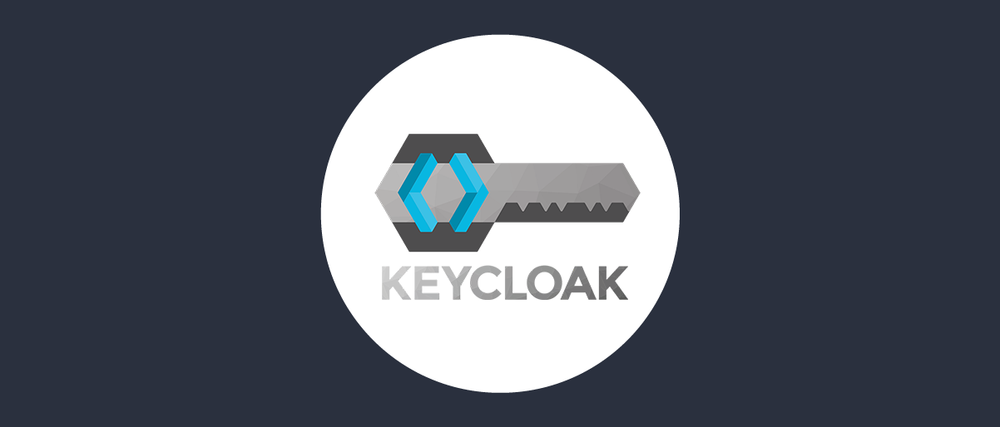
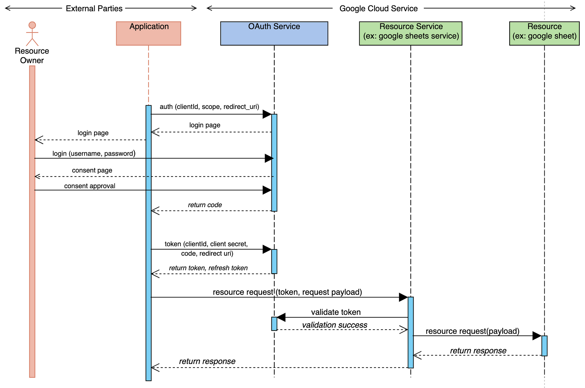

# Curso de Keycloak - Full Cycle 3.0

- O que é OAuth 2.0
- O que é Open Id Connect
- O que é Keycloak
  - Principais caracteristicas e beneficios
  - Principais casos de uso
  - Usuários
  - Clients
  - Fluxos de autenticação
  - Roles, grupos e autorização
  - Perfil de usuário
  - Temas
  - API Rest
  - Integração com front-end, node.js, java, python, java e php
  - Arquitetura multitenancy
  - Deploy

### O que é OAuth 2.0

OAuth 2.0 foi criado por um grupo de trabalho formado em 2007 pelo Internet Engineering Task Force (IETF) para resolver os problemas de segurança na autenticação e autorização de aplicativos de terceiros.

O Grupo de tabalho incluiu representantes de empresas como Google, Microsoft, Yahoo!, Facebook, Twitter e muitas outras, e após dois aos de trabalho, em 2010, a primeira versão oficial do OAuth 2.0 foi publicada.

Ao contrário de seu antecessor, o OAuth 1.0, que foi projetado especificamente para autenticação baseado em token, o OAuth 2.0 foi criado para suportar não apenas autenticação baseada em token, mas também autorização baseada em token.

Desde então, o OAuth 2.0 se tornou um dos protocolos de autenticação e autorização mais populares do mundo, utilizado por muitas empresas, aplicativos e serviços em todo o mundo. A versão atual do OAuth 2.0 é a RFC 6749, publicada em 2012, e continua sendo atualizada e aprimorada pela comunidade de desenvolvimento em todo mundo.

O OAuth 2.0 é um protocolo de autorização que permite que aplicativos obtenham acesso limitado a recursos protegidos em nome do proprietário do recurso, sem a necessidade de compartilhar as credenciais de acesso. **A estrutura do OAuth 2.0 é composto por quatro atores principais**, que interagem entre si para obter autorização e acesso a recursos protegidos:

1. **Resource Owner (Proprietário do recurso):** é o usuário ou aplicativo que possui o recurso protegido que precisa ser acessado.  Por exemplo, um usuário que deseja autorizar um aplicativo a acessar sua conta do Google Drive.
2. **OAuth Server (Servidor de autorização):** É o servidor que autentica o proprietário do recurso e concede permissões de acesso ao aplicativo solicitante. Ele é responsável por verificar a identidade do usuário e validar as credenciais de acesso.
3. **Client (Aplicativo Solicitante):** é o aplicativo que solicita acesso ao recurso protegido em nome do proprietário do recurso. O aplicativo deve ter uma identificação exclusiva e credenciais de acesso para autenticar-se junto ao servidor de autorização.
4. **Resource Server (Servidor de recurso)>** é o servidor que hospeda o recurso protegido que o aplicativo solicitante deseja acessar. Ele é responsável por verificar se o aplicativo tem permissão para acessar o recurso e conceder acesso, se a autorização for concedida.

---
**OAuth 2.0 estabelece um padrão de autenticação e autorização.**

https://www.youtube.com/watch?v=68azMcqPpyo]

